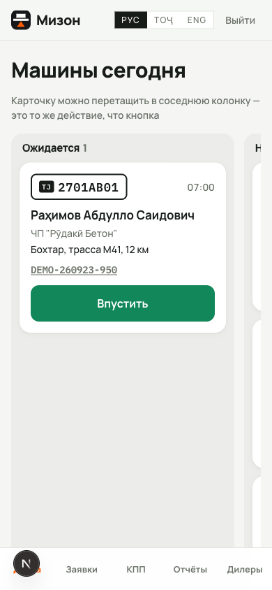
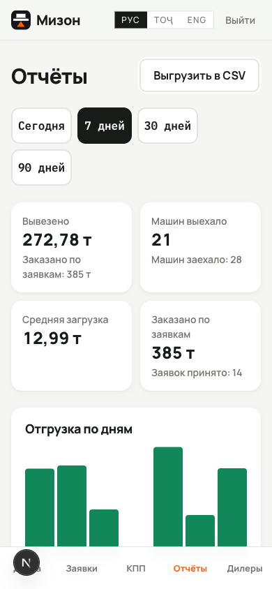
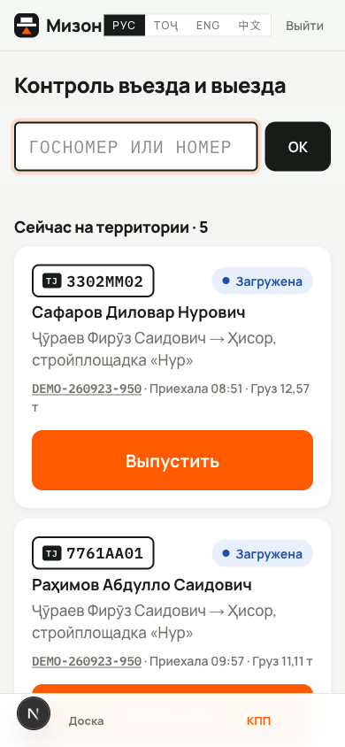

# Мизон

Заявки дилеров, контроль въезда и выезда машин, накладные, обмен с 1С.
Для предприятий, отгружающих навалочные грузы автотранспортом через весовую:
цемент, щебень, песок, известь, зерно. Номенклатура заводится в справочнике,
в коде товар не зашит. Интерфейс на русском, таджикском и английском.

Работает с телефона: ставится на домашний экран как приложение, навигация внизу,
крупные кнопки.

- Архитектура и контракт обмена с 1С — [ARCHITECTURE.md](ARCHITECTURE.md)
- Публикация тестового стенда — [DEPLOY.md](DEPLOY.md)


Доска машин по состояниям — карточку можно перетащить пальцем или мышью.
Отчёты за период с графиком и выгрузкой в CSV — [docs/reports.png](docs/reports.png).

| Телефон | | |
|---|---|---|
|  |  |  |

Дилер записывается сам на `/register`, диспетчер открывает ему доступ на
`/dealers` — только после этого контрагент уходит в 1С.

## Запуск

```bash
pnpm install
cp .env.example .env      # задайте SESSION_SECRET
pnpm db:push              # создать таблицы
pnpm db:seed              # демо-дилеры, номенклатура и пользователи
pnpm db:demo              # история отгрузок за 30 дней, чтобы отчёты не пустовали
pnpm dev
```

Демо-доступы, PIN у всех `1111`:

| Роль | Телефон |
|---|---|
| Диспетчер | +992900000001 |
| Дилер | +992900000002 |
| Охрана | +992900000003 |
| Весовщик | +992900000004 |

## Отправка в 1С

Очередь разгребается по расписанию:

```bash
curl -X POST http://localhost:3000/api/sync -H "Authorization: Bearer $SYNC_TOKEN"
```

Пока `ONEC_URL` не задан, события копятся в таблице `outbox` и ничего не теряется.
