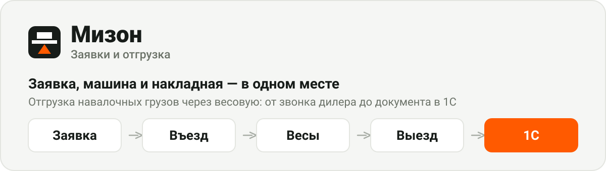
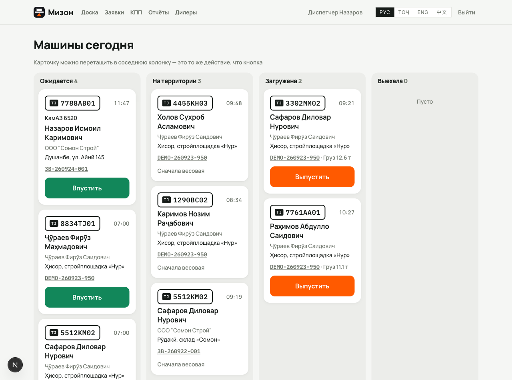
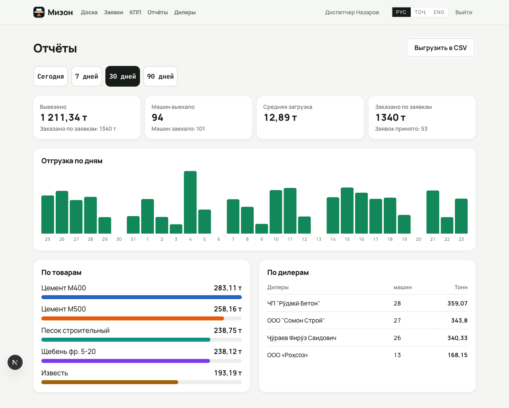

Заявки дилеров, контроль въезда и выезда машин, накладные и обмен с 1С — для предприятий, которые отгружают навалочные грузы автотранспортом через весовую.

**[Открыть демо-стенд →](https://mizon-two.vercel.app)** · на входе четыре кнопки, одно касание и вы внутри



---

## Что решает

Дилер звонит и говорит «нужно 30 тонн». Менеджер записывает на бумагу. Какая приедет машина и кто за рулём — неизвестно до самых ворот. На выезде от руки пишут накладную, и это единственное доказательство. Потом папки с бумагами и ручной ввод в 1С.

Здесь то же самое происходит в программе, а в 1С уходит готовый документ.

| Бумага | Мизон |
|---|---|
| Заявка со слов по телефону | Дилер оставляет её сам, диспетчер подтверждает |
| Машина известна только у ворот | Охрана заводит госномер и водителя при въезде |
| Вес записан в тетради | Весовая пишет брутто и тару, нетто считается само |
| Накладная от руки | Документ рождается на выезде и уходит в 1С |
| Бухгалтер вбивает вручную | Вводить нечего |

## Ключевое решение

**Заявка и машина — разные сущности.** Заявка знает «30 тонн, дилер, куда». Машина появляется позже, когда подъехала: госномер, водитель, вес, время въезда и выезда. Тридцать тонн — это два-три рейса, поэтому связь один-ко-многим, а остаток считается как заказано минус сумма нетто выехавших машин.

Отсюда же контроль: **машину нельзя выпустить без взвешивания** — это запрещает код, а не инструкция. Каждое действие пишется в журнал: кто, что, когда. Это и заменяет бумажку как единственное доказательство.

## Путь одной машины

```
Заявка            Въезд              Весы                  Выезд
дилер или   →  охрана вводит  →  брутто − тара =  →  накладная
диспетчер      номер и ФИО       нетто               уходит в 1С
```

## Роли

| Роль | Видит | Может |
|---|---|---|
| Дилер | только свои заявки | создать заявку, добавить машину |
| Диспетчер | всё | принять заявку по телефону, подтвердить, закрыть, завести дилера |
| Охрана (КПП) | доску и машины на сегодня | завести машину, впустить, выпустить |
| Весовщик | доску и машины | записать вес с грузом и вес пустой машины |

Дилер записывается сам на `/register`, но работать начинает после того, как диспетчер откроет доступ на `/dealers`. Только тогда контрагент уходит в 1С — иначе в справочнике за месяц накопятся «ООО Сомон», «ооо сомон строй» и «Сомон».

## Работает с телефона


Дилер, охрана и весовщик работают только с телефона, поэтому интерфейс сделан под них:

- ставится на домашний экран как приложение, без адресной строки;
- навигация внизу — до верха экрана рука с телефоном не дотягивается;
- мишени от 48 px, у «Впустить» и «Выпустить» — 68 px во всю ширину карточки;
- поля ввода ровно 17 px: всё, что мельче 16, заставляет Safari зумить страницу;
- госномера вводятся заглавными, без автозамены и проверки орфографии;
- если кнопки нет намеренно, интерфейс объясняет почему — у невзвешенной машины вместо «Выпустить» стоит «Ждём весовую».

Интерфейс на русском, таджикском, английском и китайском.

<br clear="right">

## Отчётность

Считается по фактам выезда — по тому же событию, которое уходит в 1С, поэтому цифры не разъезжаются.



Плитки за период, столбики по дням, разрезы по товарам и дилерам, выгрузка CSV построчно по рейсам с кодами 1С. График нарисован блоками на CSS — одна серия и один разрез не стоят ещё одной зависимости в бандле.

## Обмен с 1С

Приложение никогда не ходит в 1С из обработчика формы. Оно пишет событие в таблицу `outbox` и отвечает пользователю, а отдельный вызов `POST /api/sync` по расписанию разгребает очередь с повторами и `Idempotency-Key`. 1С и сеть завода падают — заявка от этого не теряется.

| Топик | Когда | Что создаёт в 1С |
|---|---|---|
| `dealer.approved` | диспетчер открыл доступ | Контрагента |
| `order.approved` | заявка подтверждена | Заказ клиента |
| `trip.departed` | машина выехала с грузом | Реализацию товаров |

Приход, расход и остаток по-прежнему считает 1С — бизнес-логику никуда не переносим.

## Запуск

```bash
pnpm install
cp .env.example .env      # задайте SESSION_SECRET
pnpm db:setup             # таблицы, пользователи, номенклатура и история за 30 дней
pnpm dev
```

Демо-доступы, PIN у всех `1111`: диспетчер `+992900000001`, дилер `+992900000002`, охрана `+992900000003`, весовщик `+992900000004`.

## Что внутри

| Слой | Решение | Почему |
|---|---|---|
| Фронт и бэк | Next.js 16, App Router, Server Actions | один процесс: на CRUD-нагрузке второй сервис только добавляет деплой и задержку |
| БД | SQLite через libSQL + Drizzle | один завод, сотни строк в день; локально файл, на стенде Turso по сети — драйвер один |
| Обмен с 1С | таблица `outbox` + воркер по cron | 1С и сеть падают, заявка не должна теряться |
| Авторизация | телефон и PIN, подписанная HMAC cookie | охрана вводит PIN в перчатках, а не пароль из двенадцати символов |
| Языки | свой словарь на 180 строк | четыре языка не стоят зависимости |

Боевой контур разворачивается **в локальной сети завода**, рядом с 1С: из облака до неё не достучаться. Облачный стенд нужен, чтобы показать людям и собрать замечания.

## Документы

- [ARCHITECTURE.md](ARCHITECTURE.md) — модель данных, статусы, контракт обмена и что делать 1С-разработчику
- [DEPLOY.md](DEPLOY.md) — публикация стенда на Vercel и Turso, диагностика через `/api/health`
